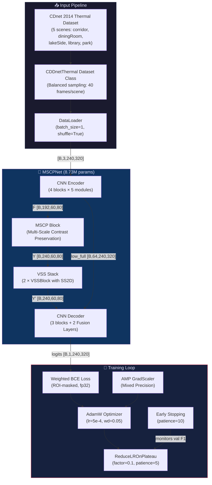
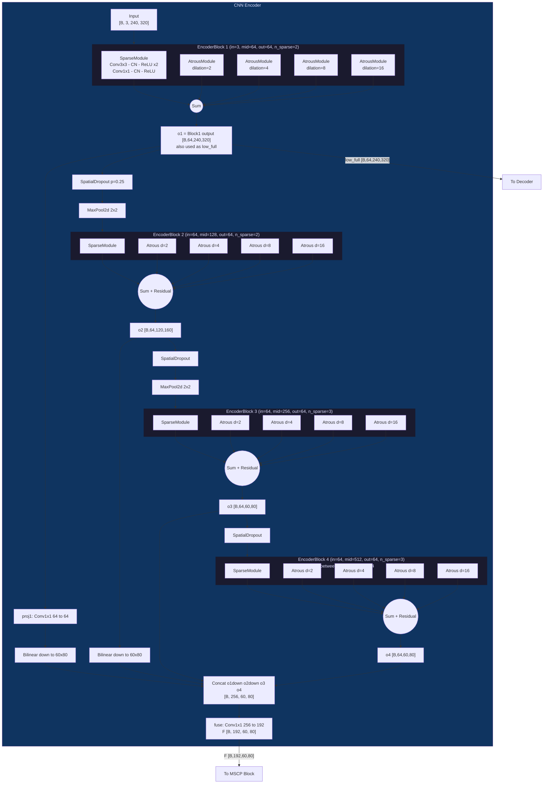
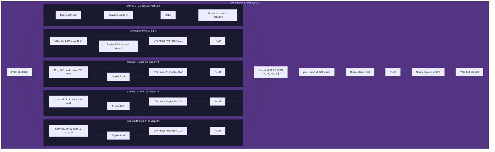
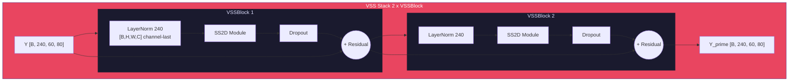
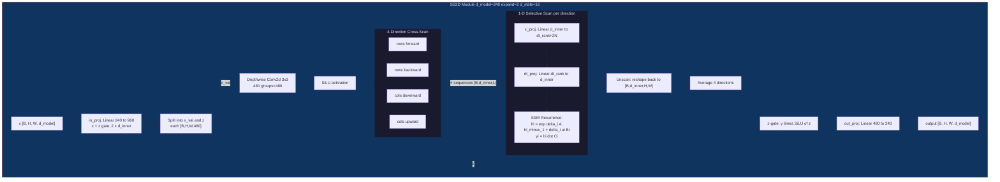
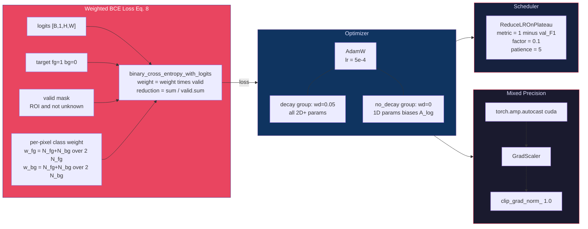
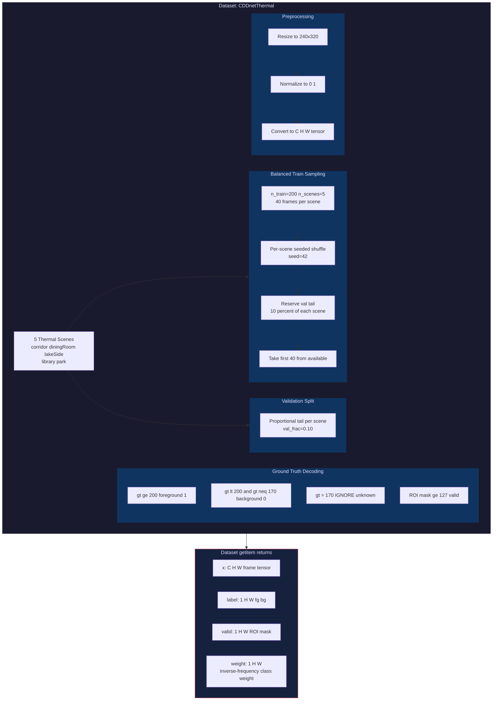
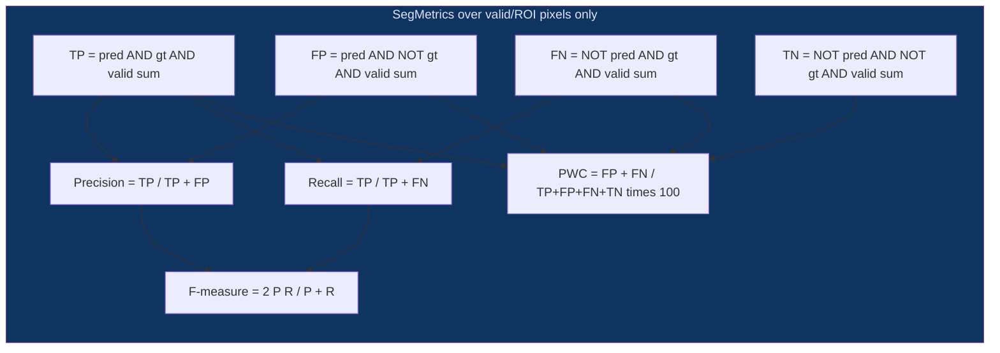

# MSCP-Mamba (Balanced Sampling) — Detailed Block Diagram

> A CNN + VSS (Vision State-Space) Hybrid Architecture for Background Subtraction on CDnet 2014 Thermal Scenes

---

## 1. High-Level Pipeline

---

## 2. CNN Encoder — Detailed Architecture

> 4 residual blocks, each with 5 parallel modules (1 sparse + 4 atrous). Outputs bottleneck `F [B,192,H/4,W/4]` and low-level features `low_full [B,64,H,W]`.

> [!NOTE]
> **SparseModule** applies `n_sparse` stacked 3x3 convolutions (each followed by ContrastNorm + ReLU), then a 1x1 reduction conv.
>
> **AtrousModule** applies a single dilated 3x3 conv (with dilation `d`) followed by ContrastNorm then ReLU.
>
> **ContrastNorm** is InstanceNorm2d (per-sample, per-channel normalization — preferred over BatchNorm for batch_size=1).

---

## 3. MSCP Block — Multi-Scale Contrast Preservation (Sec. III-B)

> The core novelty of the paper. Extracts contrast features at multiple scales and concatenates with a max-pooled global cue.

> [!IMPORTANT]
> **Eq. 6 — Contrast Computation**: `X_j = ReLU(CV_j(F) - AvgPool(CV_j(F)))`
>
> This preserves contrast information at different spatial scales by subtracting the local average from the convolved features.

---

## 4. VSS (Mamba) Stack — 2D Selective State-Space Model

> Two VSSBlocks applied sequentially after the MSCP block. Each block uses SS2D (4-direction cross-scan) for global context.

### SS2D — 2D Selective Scan (VMamba-style, 4-direction)

> [!TIP]
> **Selective Scan Dispatch**:
> - **sm80+ GPUs** (A100, L4): Uses official CUDA kernels from `mamba-ssm`
> - **T4/P100** (sm75 or lower): Falls back to a **pure-PyTorch chunked selective scan** (2-pass algorithm, O(L/chunk) sequential steps)
>
> All scans run in **fp32** (AMP-excluded) for numerical stability of delta discretization.

---

## 5. CNN Decoder

> 3 decoder blocks with 2 Fusion Layers that inject low-level encoder features via Global MaxPool attention.

```mermaid
flowchart TB
    subgraph DECODER["CNN Decoder in=240"]
        Y_PRIME_IN["Y_prime [B, 240, 60, 80]"]
        LOW["low_full [B, 64, 240, 320]<br/>from Encoder Block 1"]

        subgraph DB1["Decoder Block 1"]
            DCONV1["Conv 3x3 240 to 64 pad=1"]
            DCN1["ContrastNorm 64"]
            DRELU1["ReLU"]
            DCONV1 --> DCN1 --> DRELU1
        end
        Y_PRIME_IN --> DB1

        subgraph FL1["FusionLayer 1 dec=64 low=64"]
            LOW_CONV1["Conv1x1 64 to 64 on low_full"]
            GMP1["AdaptiveMaxPool2d 1<br/>gives [B,64,1,1]"]
            INTERP_F1["Bilinear up to dec_out size"]
            MUL1(("Multiply"))
            ADD1(("Add"))
            LOW_CONV1 --> GMP1 --> INTERP_F1 --> MUL1
            MUL1 --> ADD1
        end
        DRELU1 --> MUL1
        DRELU1 --> ADD1
        LOW --> LOW_CONV1

        UP1["Bilinear up x2<br/>[B,64,60,80] to [B,64,120,160]"]
        ADD1 --> UP1

        subgraph DB2["Decoder Block 2"]
            DCONV2["Conv 3x3 64 to 64"]
            DCN2["ContrastNorm 64"]
            DRELU2["ReLU"]
            DCONV2 --> DCN2 --> DRELU2
        end
        UP1 --> DB2

        subgraph FL2["FusionLayer 2"]
            LOW_CONV2["Conv1x1 64 to 64 on low_full"]
            GMP2["AdaptiveMaxPool2d 1"]
            INTERP_F2["Bilinear up"]
            MUL2(("Multiply"))
            ADD2(("Add"))
            LOW_CONV2 --> GMP2 --> INTERP_F2 --> MUL2
            MUL2 --> ADD2
        end
        DRELU2 --> MUL2
        DRELU2 --> ADD2
        LOW --> LOW_CONV2

        UP2["Bilinear up x2<br/>[B,64,120,160] to [B,64,240,320]"]
        ADD2 --> UP2

        subgraph DB3["Decoder Block 3"]
            DCONV3["Conv 3x3 64 to 64"]
            DCN3["ContrastNorm 64"]
            DRELU3["ReLU"]
            DCONV3 --> DCN3 --> DRELU3
        end
        UP2 --> DB3

        HEAD["head: Conv1x1 64 to 1<br/>raw logits no sigmoid"]
        DRELU3 --> HEAD

        LOGITS["logits [B, 1, 240, 320]"]
        HEAD --> LOGITS
    end

    style DECODER fill:#16213e,stroke:#e94560,color:#e0e0ff
    style DB1 fill:#1a1a2e,stroke:#16213e,color:#e0e0ff
    style DB2 fill:#1a1a2e,stroke:#16213e,color:#e0e0ff
    style DB3 fill:#1a1a2e,stroke:#16213e,color:#e0e0ff
    style FL1 fill:#0f3460,stroke:#16213e,color:#e0e0ff
    style FL2 fill:#0f3460,stroke:#16213e,color:#e0e0ff
```

> [!NOTE]
> **FusionLayer formula**: `fused = (GlobalMaxPool(Conv1x1(low)) * dec_out) + dec_out`
>
> This applies channel attention from low-level features onto the decoded features, then adds a residual.

---

## 6. Loss, Optimizer and Training Details

---

## 7. Data Pipeline — Balanced Sampling

---

## 8. Complete Forward Pass — Tensor Shapes

| Stage | Component | Input Shape | Output Shape |
|-------|-----------|-------------|--------------|
| 1 | **Input** | — | `[B, 3, 240, 320]` |
| 2 | **Encoder Block 1** | `[B, 3, 240, 320]` | `o1 [B, 64, 240, 320]` |
| 3 | **SpatialDropout + MaxPool** | `[B, 64, 240, 320]` | `[B, 64, 120, 160]` |
| 4 | **Encoder Block 2 + Residual** | `[B, 64, 120, 160]` | `o2 [B, 64, 120, 160]` |
| 5 | **SpatialDropout + MaxPool** | `[B, 64, 120, 160]` | `[B, 64, 60, 80]` |
| 6 | **Encoder Block 3 + Residual** | `[B, 64, 60, 80]` | `o3 [B, 64, 60, 80]` |
| 7 | **SpatialDropout** (no pool) | `[B, 64, 60, 80]` | `[B, 64, 60, 80]` |
| 8 | **Encoder Block 4 + Residual** | `[B, 64, 60, 80]` | `o4 [B, 64, 60, 80]` |
| 9 | **Multi-scale Fusion (Concat+1x1)** | `[B, 256, 60, 80]` | `F [B, 192, 60, 80]` |
| 10 | **MSCP Block** | `[B, 192, 60, 80]` | `Y [B, 240, 60, 80]` |
| 11 | **VSSBlock 1 (SS2D)** | `[B, 240, 60, 80]` | `[B, 240, 60, 80]` |
| 12 | **VSSBlock 2 (SS2D)** | `[B, 240, 60, 80]` | `Y' [B, 240, 60, 80]` |
| 13 | **Decoder Block 1 + Fusion** | `[B, 240, 60, 80]` | `[B, 64, 60, 80]` |
| 14 | **Bilinear up x2** | `[B, 64, 60, 80]` | `[B, 64, 120, 160]` |
| 15 | **Decoder Block 2 + Fusion** | `[B, 64, 120, 160]` | `[B, 64, 120, 160]` |
| 16 | **Bilinear up x2** | `[B, 64, 120, 160]` | `[B, 64, 240, 320]` |
| 17 | **Decoder Block 3** | `[B, 64, 240, 320]` | `[B, 64, 240, 320]` |
| 18 | **Head Conv1x1** | `[B, 64, 240, 320]` | `logits [B, 1, 240, 320]` |
| 19 | **Sigmoid + Threshold (ge 0.9)** | `logits [B, 1, 240, 320]` | `prediction [B, 1, 240, 320]` |

---

## 9. Key Hyperparameters

| Parameter | Value | Notes |
|-----------|-------|-------|
| `arch` | `cnn_mamba` | Hybrid CNN + VSS |
| `sampling` | `balanced` | 40 frames/scene (evenly split) |
| `n_vss` | `2` | VSS blocks after MSCP |
| `vss_expand` | `2` | SS2D inner dim = 2 x 240 = 480 |
| `vss_d_state` | `16` | SSM state size N |
| `scan_chunk` | `64` | Chunk length for PyTorch fallback scan |
| `img_size` | `(240, 320)` | H x W |
| `n_train` | `200` | Total training frames |
| `batch_size` | `1` | Paper specification |
| `adamw_lr` | `5e-4` | For CNN+Mamba hybrid |
| `adam_wd` | `0.05` | Excludes norms/SSM state |
| `threshold` | `0.9` | Pixel decision threshold |
| `sd_rate` | `0.25` | SpatialDropout rate |
| `max_epochs` | `100` | With early stopping |
| `early_stop_patience` | `10` | Epochs without improvement |
| **Total params** | **8.73M** | CNN-only baseline: 7.92M |

---

## 10. Evaluation Metrics

